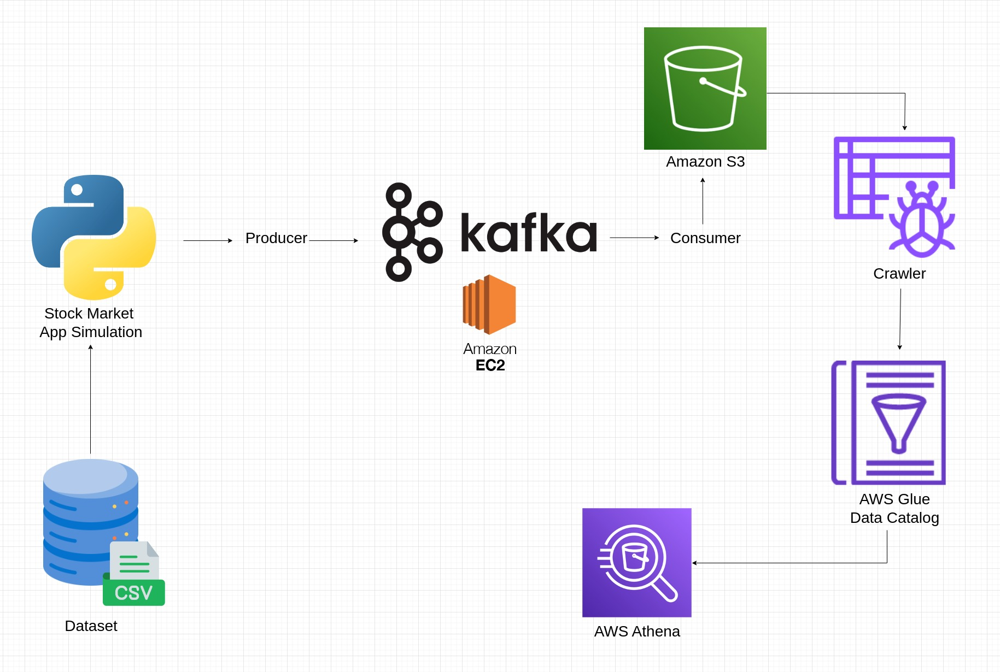

# Real Time ETL Pipeline

Real Time End-to-end data pipeline  Engineering Project using Kafka, AWS, Apache Kafka, Glue, Athena, and SQL.

## Description

### Objective

The goal of this project is to  execute an End-To-End Data Engineering Project on Real-Time Stock Market Data using Kafka.We are going to use different technologies such as Python, Amazon Web Services (AWS), Apache Kafka, Glue, Athena, and SQL.

### Dataset

We can use any dataset, we are mainly interested in operation side of Data Engineering (building data pipeline)

Here is the dataset we used  - [Link](https://github.com/aditishraq/Realtime-ETL-Pipeline/blob/main/indexProcessed.csv)

### Tools & Technologies

- Cloud - [**Amazon Web Service (AWS)**](https://console.aws.amazon.com)

- Transformation - [**Apache Kafka**](https://kafka.apache.org/)

- Language - [**Python**](https://www.python.org)

### Architecture

## Setup

**WARNING: You will be charged for all the infra setup. You can avail 300$ in credit by creating a new account on AWS.**
### Pre-requisites

If you already have a AWS account, you can skip the pre-requisite steps.

- Amazon Web Service. 
  - [AWS Account and Access Setup](https://k21academy.com/amazon-web-services/aws-solutions-architect/create-aws-free-tier-account/)

  

